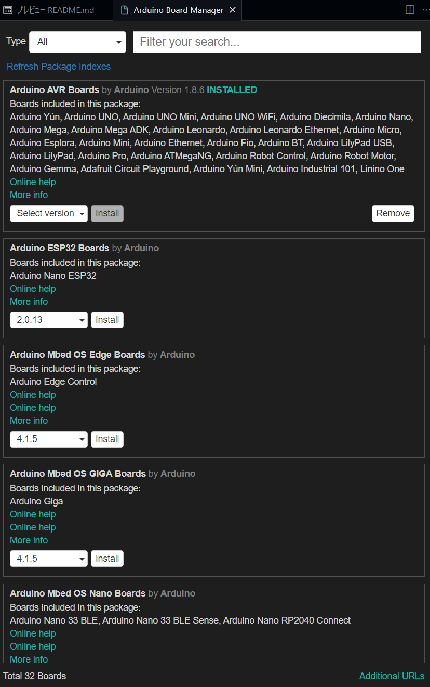
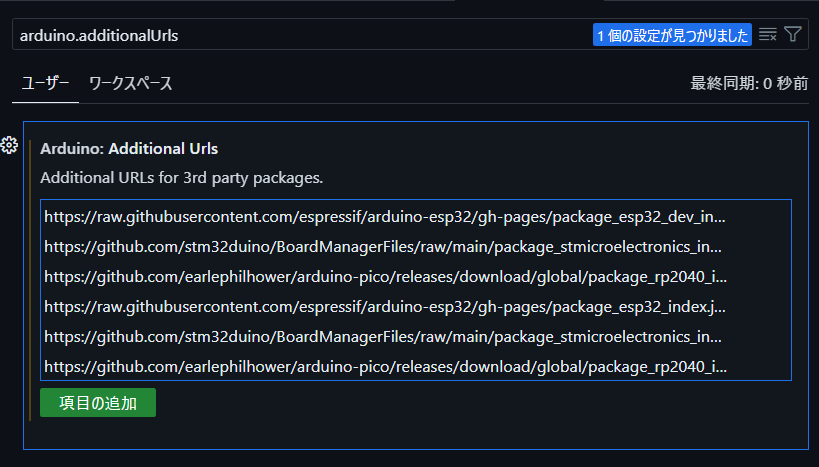
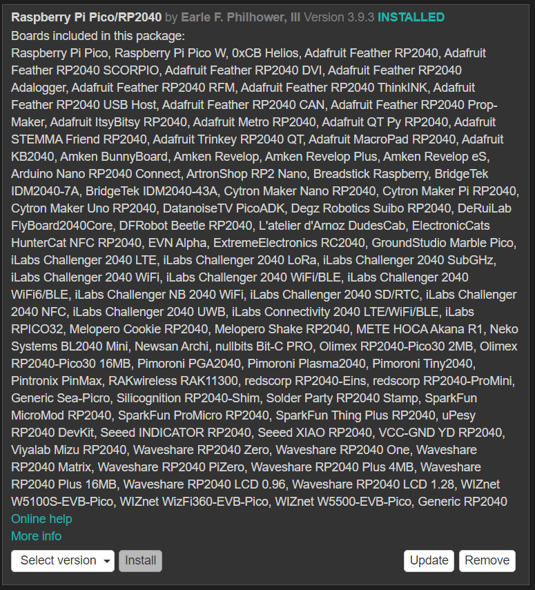
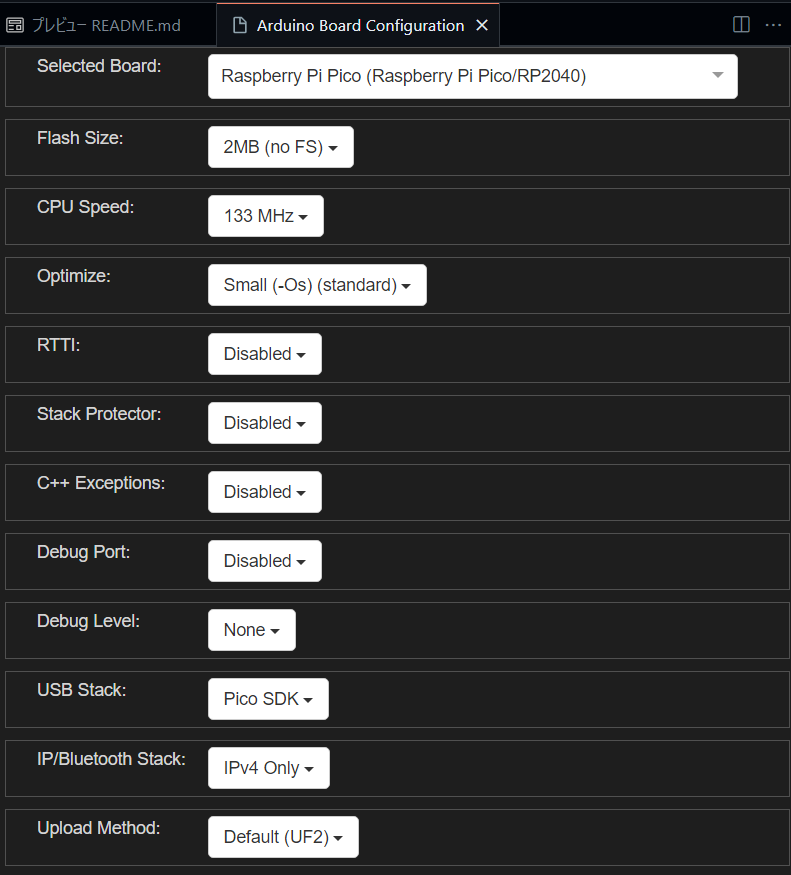
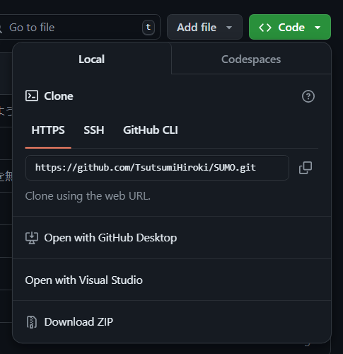
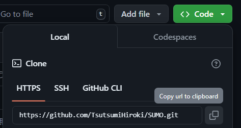
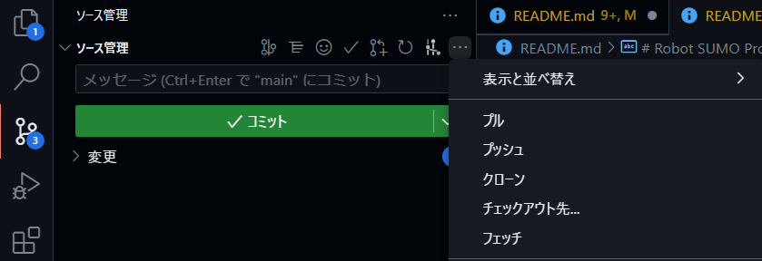
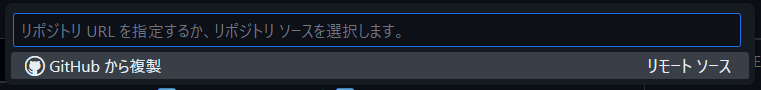

# Robot SUMO Projects

## 開発環境
- Arduino
- [Arduino-Pico](https://github.com/earlephilhower/arduino-pico)

## 使用したハードウェア
- Odrive
- Raspberry Pi Pico

## 開発環境の構築
### Raspberry Pi Pico

詳細は[こちら](https://github.com/earlephilhower/arduino-pico?tab=readme-ov-file#installation)を見た方が正確です．

1. Arduino Board Manager を選択
   
   Ctrl + Shift + P でコマンドパレットを呼び出し，「Arduino: Board Manager」を検索し，選択
    

2. Additional URLs に Arduino Pico を追加
   1. 右下，Additional URLs を選択
   2. 「項目の追加」を選択
   
    
   3. 下記URLをコピーしてペースト
   
   https://github.com/earlephilhower/arduino-pico/releases/download/global/package_rp2040_index.json

3. Raspberry Pi Pico/RP2040 を追加
   1. 再度，Arduino Board Manager を選択
   2. 画像と同じ Raspberry Pi Pico/RP2040 をインストール
   
   

4. Arduino Board Configuration の設定
   1. Ctrl + Shift + P でコマンドパレットを呼び出し，「Arduino: Board Config」を検索し，選択
   2. 「Selected Board」に「Pico」と検索し「Raspberry Pi Pico」を選択．少し待つとその他設定が現れるが特に初期設定からいじる必要はない．
   
   

### Githubからのクローン
1. Code を選択し，HTTP を選択
   
2. URL をコピー
   
3. ソース管理からクローンを選択
   
4. コピーした URL をペースト
   

   Enter で確定
5. 保存するディレクトリを設定
   
   後から見つけられるようにしておこう